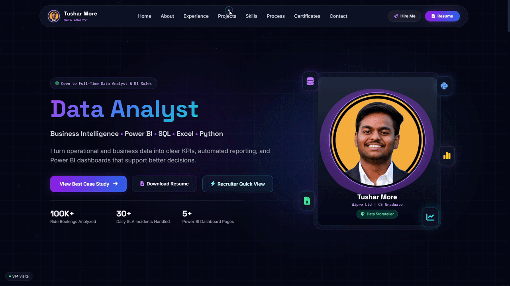

# 👋 Tushar More | Data Analyst Portfolio

A single-page, dark-themed portfolio website built to showcase my journey as a **Data Analyst** — from MIS reporting and SLA operations at Wipro to Power BI dashboards, SQL analytics, and Python projects.

Live focus: **fast recruiter comprehension**. The site is built around getting a hiring manager from "who is this" to "let's talk" in under 60 seconds, with a dedicated Recruiter Quick View, proof-point stats, and one-click resume/contact actions.



---

## 🚀 Live Demo

- **Portfolio:** [tushargithub0103.github.io/MyDataAnalystPortfolio](https://tushargithub0103.github.io/MyDataAnalystPortfolio)
- **GitHub:** [github.com/tushargithub0103](https://github.com/tushargithub0103)
- **LinkedIn:** [linkedin.com/in/tusharmore132](https://linkedin.com/in/tusharmore132)

---

## ✨ Features

- **⚡ Recruiter Quick View** — a one-screen modal summarizing experience, skills, education, and top projects for recruiters short on time, with direct Resume / WhatsApp / Email CTAs.
- **🎯 Hero proof points** — bookings analyzed, SLA incidents handled, dashboard pages shipped — front and center, no scrolling required.
- **🌌 Animated particle background** — lightweight canvas-based particle system for subtle depth without hurting performance.
- **🖱️ Custom cursor halo** — a minimal "data-orbit" cursor effect on pointer devices.
- **🎞️ Auto-scrolling tech marquee** — infinite-loop strip of tools/technologies (SQL, Power BI, Python, Excel, ServiceNow, Git).
- **🧩 Fully responsive** — mobile-first layout with a dedicated slide-out mobile nav drawer.
- **📊 Case-study-style project cards** — each project frames the business question, dataset size, tools used, and measurable outcome (not just a tech list).
- **🔔 Toast notifications** — for resume downloads and form submissions.
- **📬 Working contact form** — powered by [FormSubmit](https://formsubmit.co/), no backend required.
- **👁️ Live visitor counter** — powered by Firebase Firestore.
- **🖼️ Dynamic favicon** — generates a circular favicon from the profile photo at runtime.
- **♿ Accessible modal** — Recruiter Quick View supports `Escape` to close, focus handling, and `aria` attributes.

---

## 🛠️ Tech Stack

| Category | Tools |
|---|---|
| Markup / Styling | HTML5, [Tailwind CSS](https://tailwindcss.com/) (via CDN, custom theme config) |
| Fonts / Icons | Google Fonts (Inter, Space Grotesk), [Font Awesome 6](https://fontawesome.com/) |
| Interactivity | Vanilla JavaScript (Canvas API, DOM APIs) |
| Backend-as-a-Service | [Firebase Firestore](https://firebase.google.com/) (visitor counter) |
| Forms | [FormSubmit](https://formsubmit.co/) (no-backend form handling) |
| Hosting | GitHub Pages |

No build step, no frameworks, no bundlers — just a single self-contained `index.html` for maximum portability and easy deployment.

---

## 📂 Sections

1. **Home** — headline, role tagline, CTAs (View Case Study / Download Resume / Recruiter Quick View), and quick stats.
2. **About** — background story, leadership highlight (Head of ACSES & CSI Club), and education snapshot.
3. **Experience** — timeline of professional roles: Wipro Ltd. (Production Agent) and Vibrant Minds Technologies (Developer Intern).
4. **Projects** — case studies including:
   - **OLA Ride Analytics Dashboard** (Power BI, SQL, Excel) — 100K+ bookings analyzed
   - **Customer Shopping Behavior Analysis** (Python, SQL, Power BI) — 3,900+ records
   - **Sentiment Analysis Web App** (Python, NLP, Streamlit) — 82% model accuracy
   - Upcoming/in-progress dashboards
5. **Skills** — languages & libraries, BI tools, analytics concepts, developer tools, and AI productivity tools.
6. **Process** — 4-step methodology from business goal → data cleaning → SQL/DAX analysis → insights & reporting.
7. **Certificates** — verified credentials (Udemy, HackerRank) and in-progress certifications (Microsoft PL-300).
8. **Contact** — email, phone, WhatsApp, location, socials, and a working contact form.

---

## 🖥️ Getting Started

Since this is a static, dependency-free site, you can run it locally in seconds:

```bash
# Clone the repo
git clone https://github.com/tushargithub0103/MyDataAnalystPortfolio.git
cd MyDataAnalystPortfolio

# Open directly in your browser
open index.html    # macOS
# or just double-click index.html
```

For live-reload during edits, you can optionally serve it with any static server, e.g.:

```bash
npx serve .
```

### Deploying

The site is deployed via **GitHub Pages**. To deploy your own fork:

1. Push to a GitHub repository.
2. Go to **Settings → Pages**.
3. Set the source branch to `main` (or `gh-pages`) and root directory.
4. Your site will be live at `https://<username>.github.io/<repo-name>`.

---

## ⚙️ Configuration Notes

- **Profile photo:** replace `TusharMoreImage.png` in the root directory to update the hero photo, favicon, and footer avatar (favicon is auto-cropped to a circle at runtime).
- **Resume link:** update the Google Drive share URL in the `downloadResume()` function and all `<a href>` resume links.
- **Contact form:** replace the FormSubmit endpoint (`https://formsubmit.co/<your-email>`) with your own email in the `<form action="">` attribute.
- **Visitor counter:** swap in your own Firebase project config (`firebaseConfig`) if you want an independent counter.
- **WhatsApp / phone / email:** update the `tel:`, `wa.me`, and `mailto:` links in the Contact section.

---

## 📌 Roadmap

- [ ] Supply Chain Logistics Dashboard (Power BI — SLA delivery performance)
- [ ] E-Commerce Revenue Analytics (SQL CTEs — CLV, churn, cohort retention)
- [ ] ServiceNow Incident Trends (automated MIS reporting)
- [ ] Microsoft PL-300 (Power BI Data Analyst Associate) certification

---

## 📄 License

This project is personal portfolio code. Feel free to fork it for inspiration, but please swap out personal content, photos, and contact details before publishing your own version.

---

## 🤝 Let's Connect

I'm actively open to **Data Analyst, MIS Analyst, Business Intelligence Analyst,** and **Reporting Analyst** roles.

📧 [tusharmore1302@gmail.com](mailto:tusharmore1302@gmail.com) · 💬 [WhatsApp](https://wa.me/919518344151) · 💼 [LinkedIn](https://linkedin.com/in/tusharmore132)
